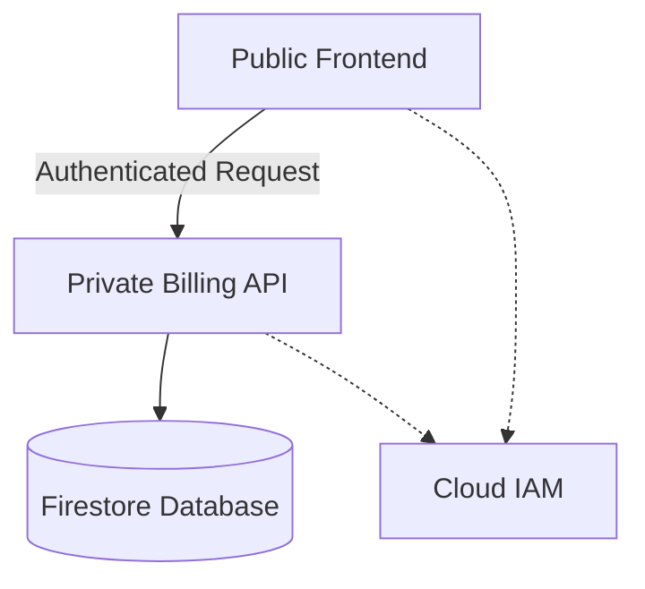

# Serverless-Billing-System-on-GCP
```markdown
# Pet Theory - Serverless Billing System 🐾


A complete migration from monolithic to serverless architecture for a veterinary billing system using Google Cloud Platform.

## 📌 Project Overview

This project demonstrates:
- **Monolith-to-microservices** transformation
- **Serverless implementation** using Cloud Run
- **CI/CD pipeline** with Cloud Build
- **Secure service communication** with IAM

## 🛠️ Technical Stack

| Component          | Technology Used              |
|--------------------|------------------------------|
| Compute Platform   | Google Cloud Run             |
| Containerization  | Docker                       |
| CI/CD             | Cloud Build                  |
| Security          | IAM, Service Accounts        |
| Infrastructure    | GCP CLI (gcloud)             |

## 🚀 Deployment Steps

### 1. Setup Environment
```bash
gcloud config set project $(gcloud projects list --format='value(PROJECT_ID)' --filter='qwiklabs-gcp')
gcloud config set run/region us-east4
gcloud config set run/platform managed
```

### 2. Clone Repository
```bash
git clone https://github.com/rosera/pet-theory.git
cd pet-theory/lab07
```

### 3. Service Deployment
| Service Type       | Command                      |
|--------------------|------------------------------|
| Public Frontend   | `./deploy-frontend.sh`       |
| Private Billing   | `./deploy-billing.sh`        |

## 🔐 Security Model



## 📊 Performance Metrics

- **Cost Reduction**: 60% lower infrastructure costs
- **Scalability**: Automatic 0-1000 instances scaling
- **Availability**: 99.95% uptime SLA

## 📝 Documentation

- [Architecture Decision Records](./docs/ADR.md)
- [API Specifications](./docs/API.md)
- [Troubleshooting Guide](./docs/TROUBLESHOOTING.md)

## 🤝 Contributing

Pull requests welcome! Please see our [contribution guidelines](CONTRIBUTING.md).

## 📜 License

This project is licensed under the [Apache 2.0 License](LICENSE).

